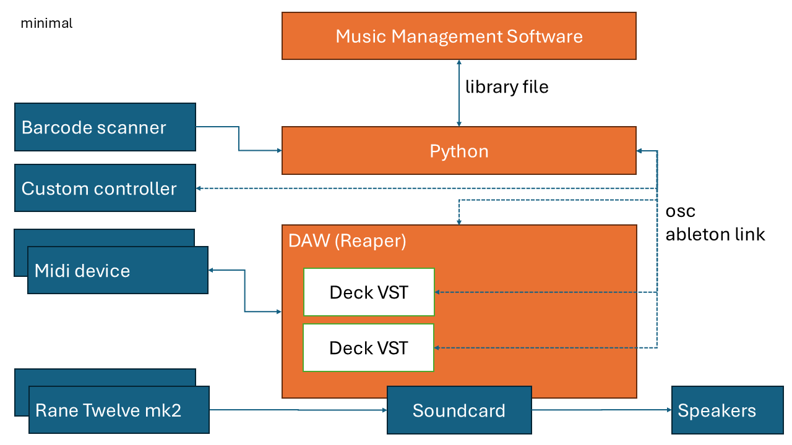
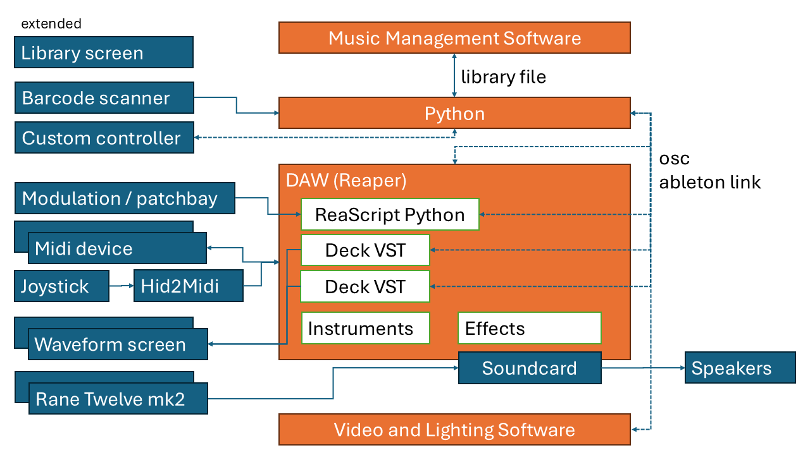

# OrangeJukebox750
I want an open and modular DJ environment, like modular synthesis but then with tracks and computer based, but not screen-based. It should be adaptable to the needs of other users too. I just get really annoyed by Traktor and especially Pioneer/Rekordbox building a closed ecosystem, no no no no nooh.

# Background
I have had allready one shot at making such a piece of software. I made it in Supercollider, and have done a few performances with it. But the basic structure of supercollider scheduling happening in the language side and then communicating to the audio thread over OSC proved to be annoying, as was the debugging experience.

# Features
Here is a list of ideas I have of things I'd like to include in my setup, ar at least be able to experiment with.

- playing digital audio files with control of speed, and knowledge of the grid,
- custom looping and beatjump mechanism, i.e. looping a phrase halfway the phrase be using grid information,
- tactile interactions, using midi but also alternative controllers like a barcode scanner and a joystick,
- audio effects and strange sound generators,
- advanced control over track selection with filtering by playlist and tags, perhaps using assistance from LLM,
- surround sound,
- on the fly parameter modulation,
- on the fly rearranging of effects.

# Philosophy
Whereas my previous approached rested on the idea that Supercollider was the one environment in which I could build al my ideas. I now try to find more established environments which suit a specific purpose, and tie them nicely together. So all the heavy lifitng is done be established tools, and I make small custom parts to let everything work together the way I like it. I consider modifying Mixxx not a direction which makes me enthusiastic, since a lot of time will be spent in finding out why the made things as they did (with a lot of legacy code), instead of building something myself. I also considered writing an entire application in JUCE, but this will probably take more time, and there is less that I can use from others, and furthermore it will be less easy for others to adapt it to their situation.

# Minimal Architecture
## Components
The system will consist of the following componennts:
- a VST host, I will go for Reaper myself because it is highly customizable and has good support for surround;
- a DJ-deck VST with support for DVS written in [JUCE](https://juce.com/). We can hopefully port some of the [xWax](https://xwax.org/) code, and make something like [MsPinky](https://mspinky.com/). Initial support for Serato timecode (because then Rane Twelve mk2 can be used). It will have a very minimal gui. Tracks should be loadable using an OSC message.;
- a Python program:
    - music library, supporting interaction using a barcode scanner (HID), communicating the selected track via OSC to the DJ deck VSTs. Initially support for Traktor NML using [traktor NML utils](https://github.com/wolkenarchitekt/traktor-nml-utils). Use [Beets](https://github.com/beetbox/beets) for track management;
    - other high level noncritical-timing task;
- music management takes place in third party software such as Rekordbox, Traktor, or [Lexicon](https://www.lexicondj.com/about).

## Communication
- All audio timing is done internally in the DAW / VST;
- All non-timing critical information is done using OSC;
- Ableton Link is used to modify the master clock from the VST, and can also be used to align other software later on (i.e. lighting).

## Overview
An overview of all the basic components looks like this:

# Extended Architecture
If we have any time left.
## Low Priority Features
- The DJ decks can sync the master playback to their current playback using ableton link; 
- Support for [DJ XML](https://djxml.com);
- Modulation signals and midi effects using Reaper JFSX and 14 bit MIDI;
- Pathbay and modulation support using Python Reascript to dynamically assign routing and modulation, based on midi and osc input, from amongst others a mock-up patchbay. In the mock-up patchbay each output port send a unique digital identifier (could for example just be the pulsewidth), and each input identifies what he gets fed. That way you can use physical wires to rewire software. For modulation we implement the concept that of you hold a "assign" button, and then wiggle two knobs; the second knob gets mapped to the first knob, perhaps using [MiditoReaControlPath](https://forum.cockos.com/showthread.php?t=43741) or ReaControlMIDI, to create a kind of proxy which allows to inject a modulation signal on top of a controller mapping, i.e. this proxy layer would be mapped to the VST parameters, and you would map you controller to the proxy, but this proxy is also listening to another midi channel on control path, on which you send your modulation signal;
- Open-source python based DJ music library software, with a good GUI, support for tagging, waveform visualization, grids;
- Support for HID game controllers, using a hid2midi converter;
- Per deck minimal waveform visualization using for example a Raspberry Pi, with the main purpose of visualizing the coming 16 bars, to see if an important phrase transition occurs.
- Audio effects written in Faust;

## Overview

# Links
- https://github.com/wolkenarchitekt/traktor-nml-utils
- https://www.admiralbumblebee.com/music/2018/02/08/Write-a-Reaper-MIDI-JSFX-from-scratch.html#statements
